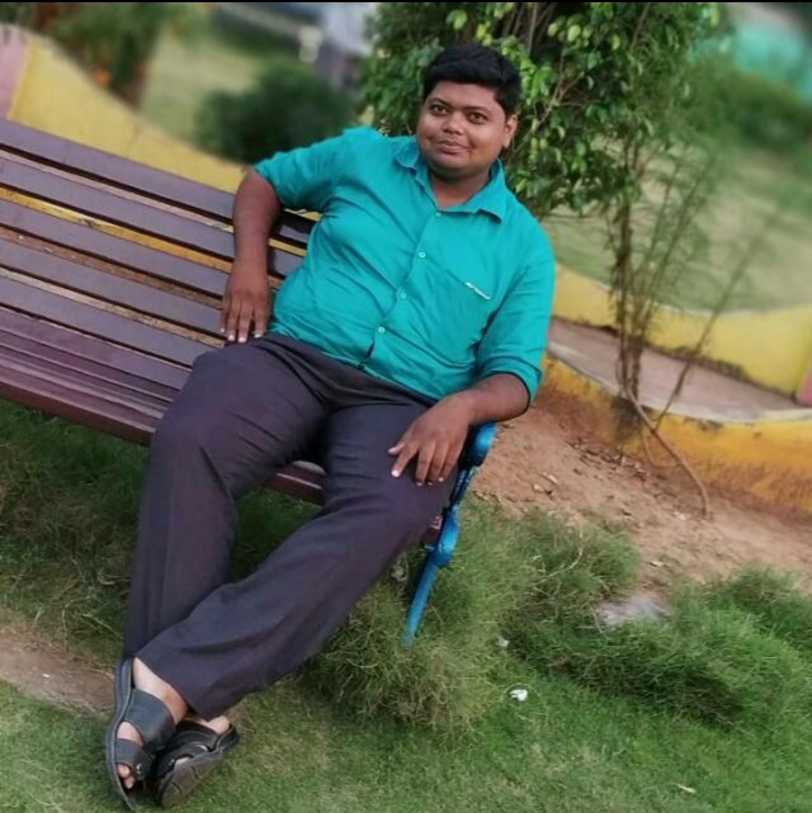
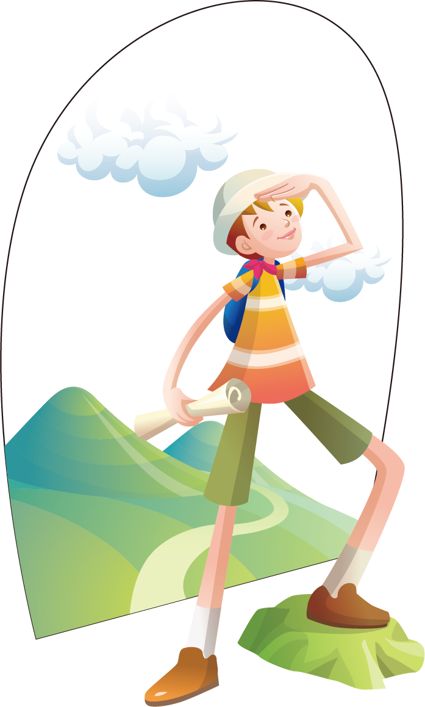

<!DOCTYPE html>
<html>

<head>
  <meta charset="utf-8">
  <title>smart class</title>
  <link rel="stylesheet" href="css.css">
  

  </script>
  <link href="https://fonts.googleapis.com/css?family=Merriweather|Montserrat|Sacramento" rel="stylesheet">
  <link rel="preconnect" href="https://fonts.googleapis.com">
  <link rel="preconnect" href="https://fonts.gstatic.com" crossorigin>
  <link href="https://fonts.googleapis.com/css2?family=Itim&family=Permanent+Marker&display=swap" rel="stylesheet">
  <link rel="icon" href="favicon.ico">
</head>

<body>
  <nav id='menu'>
  <input type='checkbox' id='responsive-menu' onclick='updatemenu()'><label></label>
  <ul>
    <li><a href='smart clases.html'>Home</a></li>
    <li><a class='dropdown-arrow' href='http://'>results</a>
      <ul class='sub-menus'>
        <li><a href='class X.html'>class X</a></li>
        <li><a href='http://'>class IX</a></li>
        <li><a href='http://'>class vIII</a></li>
        <li><a href='http://'>class vIII</a></li>
      </ul>
    </li>
    <li><a href='http://'>courses</a></li>
    <li><a class='dropdown-arrow' href='http://'>CCA</a>
      <ul class='sub-menus'>
        <li><a href='http://'>Sub Menu 1</a></li>
        <li><a href='http://'>Sub Menu 2</a></li>
        <li><a href='http://'>Sub Menu 3</a></li>
      </ul>
    </li>
    <li><a href='mailto:kinnngpinku93@gmail.com'>Contact Us</a></li>
  </ul>
</nav>
  
  
  

    

      <h1>Smart classes</h1>
      <h2>climb the mountain of education with us.</h2>
    

    <!--   -->
  

  

    

      <h2>Founder: Biswajit sir</h2>
      
      
warm and caring teacher who wants all children to be sucessful
learners and works to create a classs room atmosphere that is simulating,
encouraging and various needs of students.

    

    

    <table>
      <thead>
        <tr>
          <th colspan="2"><h2>Some of Intresting Programs we Do</h2></th>
        </tr>
      </thead>

      <td>
        

          

            

            <h3>Quiz competition</h3>
            
we often arrange quize competition for students to improve their general knowledge and thia also helps them to perform better in their intra-school competition.

          

          

            

            <h3>Excursion</h3>
            
We made this program, to make the study of history esier and to get intrested in it. unless we all know how much history makes us sleepy.

          

      </td>
      <td>
        

          

            

            <h3>picnic</h3>
            
picnic is heart and soule of every coaching center.
            we do go to picnic on winters ,probably on new years.

          

          

            

            <h3>Puja</h3>
            
we celebrate both ganeah puja and saraswati puja here and make classes off on major hindu festivals.

          

      </td>
    </table>
    

      <h2>Course info.</h2>
      

        

        <h3>Brief on our courses</h3>
        
We offer courses for both CBSE and STATE BOARD students. from class VIII to class X. We also give computer education with central govt. registered ceertificate(This course can only be taken after class X.).

    

    
    

    

      <h2 id = wantaddmission>Get In Touch</h2>
      <h3 id="betterresult">If you want a better result.</h3>
      
take this advantage now 👇

      <a class="btn" href="mailto:kinnngpinku93@gmail.com">CONTACT US</a>
    

  

  

    <a class="footer-link" href="">LinkedIn</a>
    <a class="footer-link" href="">Twitter</a>
    <a class="footer-link" href="">Telegram</a>
    
© 2021 smart classes @ DeveloperRK .

  

</body>

</html>
